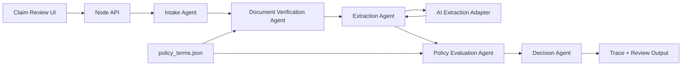

# Architecture

## Goal

The system is designed as a small multi-agent claims pipeline where each component has one responsibility and emits trace events. The key product requirement is not only to decide a claim, but to make the decision reconstructable by an operations reviewer.

## Components

## Request Flow

1. The UI submits member details, treatment type, amount, dates, pre-authorization status, and documents.
2. The Intake Agent normalizes the payload and creates a claim trace.
3. The Document Verification Agent reads `policy_terms.json` and checks required documents for the claim type.
4. If documents are wrong or missing, the claim stops immediately with a specific error.
5. The Extraction Agent uses the AI Extraction Adapter contract to parse structured signals from each document: patient, diagnosis, provider, tests, amounts, dates, line items, confidence, and quality issues.
6. The Policy Evaluation Agent executes policy checks from configuration.
7. The Decision Agent maps checks into final decision, approved amount, reason, and confidence.
8. The UI renders the decision, checks, extracted fields, and full trace.

## Design Choices

The policy engine is deterministic. This is deliberate: policy decisions must be auditable, repeatable, and easy to test. AI-style extraction belongs before the policy engine, and the extracted schema becomes the boundary between probabilistic and deterministic logic.

The extraction layer is implemented behind a schema-guided AI adapter. In this assignment run it uses deterministic local extraction so evals are stable and do not need API keys, but the adapter already defines the prompt contract, JSON shape, validation, confidence score, and trace surface for plugging in OCR plus an LLM extraction call.

Document verification happens before extraction. This avoids wasting OCR/LLM calls when a claim is not processable and gives the member fast, actionable feedback.

Every component writes trace events. The trace is not an afterthought; it is the operational product surface for claim reviewers.

## Failure Handling

Extraction errors are captured per document and converted into `DEGRADED` trace events. The AI Extraction Adapter validates output before policy evaluation; validation failures are visible in trace and reduce confidence. The system continues with remaining signals. API-level failures return `MANUAL_REVIEW` instead of crashing.

## Limitations

- Uploaded images/PDFs are represented as OCR text in this prototype.
- The AI adapter is wired with a deterministic extractor for the submitted demo; production would connect the same contract to OCR and an LLM.
- Historical utilization, duplicate claims, and fraud scoring are represented only through the policy thresholds that can be evaluated from a single claim.
- The reconstructed test suite may differ from Plum's original hidden `test_cases.json`.

## Scaling To 10x

At higher volume, I would split the pipeline into asynchronous stages: document intake, OCR, extraction, policy evaluation, and review publishing. OCR and LLM extraction would run on queues with retries and idempotency keys. Policy evaluation would remain synchronous and deterministic once extraction completes. Trace events would be written to an append-only store so ops can audit decisions even if downstream systems change.

For reliability, each component would have contract tests, schema validation, versioned prompts/models, and replayable eval runs. For cost control, document verification and file classification should happen before expensive OCR/LLM calls.
